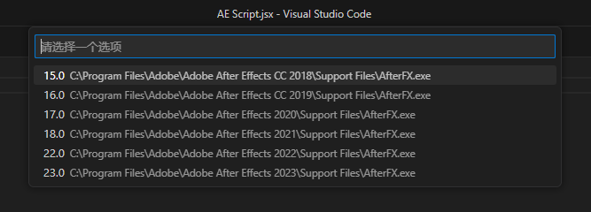

# AEスクリプト実行ツール for VS Code 🚀

[](https://marketplace.visualstudio.com/items?itemName=yourname.ae-script-runner)
[](https://license/)
[](https://www.adobe.com/products/aftereffects.html)
[](https://www.adobe.com/products/aftereffects.html)

VS Code から直接 **Adobe After Effects スクリプト（`.jsx`, `.tsx`, `.ts`, `.jsxbin`）** を実行できます。

*▲ VS Code から直接スクリプトを実行可能*

[中文说明](README-ZH.md) | [English](README.md) | [Japanese](README-JP.md)

## ✨ 機能

* 🎯 **ワンクリック実行** - After Effects スクリプトを VS Code から直接実行
* 📦 **TypeScript 対応** - `.tsx` / `.ts` コンパイルを完全サポート
* 🔄 **ビルドツール自動検出** - Rollup / Webpack / esbuild / tsc を自動判定
* 🌍 **多言語対応** - 英語・中国語 UI
* 🖥️ **クロスプラットフォーム** - Windows / macOS 対応
* ⚡ **スマート検出** - 起動中の AE インスタンスを自動検出

🚀 クイックスタート

### ① インストール

VS Code Marketplace からインストールします。

### ② 使い方

1. `.jsx`, `.tsx`, `.ts`, `.jsxbin` ファイルを開く
2. After Effects を起動しておく
3. エディタツールバーの ▶ **Run Script** ボタンをクリック



*▲ マルチバージョンAE検出インターフェース*

③ TypeScript プロジェクトの場合

[Adobe After Effects TypeScript クリプトデモ](https://github.com/Yuelioi/adobe-after-effects-scripting-demo)から始めることができます

依存関係をインストール：

```bash
npm install -D typescript rollup @rollup/plugin-typescript
```

tsconfig.json を作成：

```json
{
  "compilerOptions": {
    "target": "ES3",
    "outDir": "./dist",
    "strict": true,
    "types": ["./node_modules/types-for-adobe/AfterEffects/22.0"]
  },
  "include": ["src/**/*.ts", "src/**/*.tsx"]
}

```

## ⚙️ 設定

VS Code の設定（`.vscode/settings.json`）でカスタマイズ可能です：

```json
{
  "ae-tsx-runner.hostSpecifier": "aftereffects-25.0",
  "ae-tsx-runner.buildTool": "auto"
}

```

### 設定オプション一覧

| 設定項目               | 説明                                                                  | 既定値                 |
| ---------------------- | --------------------------------------------------------------------- | ---------------------- |
| `hostSpecifier`      | 使用する AE バージョン（例：`aftereffects-25.0`）                   | 空欄（または選択画面） |
| `buildTool`          | 使用ビルドツール：`auto`/`tsc`/`rollup`/`webpack`/`esbuild` | `auto`               |
| `customBuildCommand` | カスタムビルドコマンド（例：`npm run build`）                       | `""`                 |

### Rollup 設定例

`.vscode/settings.json` から入力/出力パスを読み込み可能：

```js
// rollup.config.js
import { readFileSync } from 'fs';
import JSON5 from 'json5';

const settings = JSON5.parse(readFileSync('.vscode/settings.json', 'utf8'));
const input = settings['ae-tsx-runner.input'] || 'src/main.tsx';
const output = settings['ae-tsx-runner.output'] || 'dist/main.jsx';

export default {
  input,
  output: { file: output, format: 'cjs' },
  // ...その他の設定
};

```

---

## 📁 プロジェクト構成

```textyour-project/
├── .vscode/
│   └── settings.json        # 自動生成設定
├── src/
│   └── main.tsx             # スクリプト本体
├── dist/
│   └── main.jsx             # 出力結果
├── tsconfig.json
├── rollup.config.js         # 任意
└── package.json
```

---

## 🔧 ビルドツール設定

複数のビルドツールをサポートします。

### 自動検出（推奨）

```json
{
  "ae-tsx-runner.buildTool": "auto"
}
```

検出順序：Rollup → Webpack → esbuild → tsc

---

### 手動指定

```json
{
  "ae-tsx-runner.buildTool": "rollup"
}

```

---

### カスタムコマンド

```json
{
  "ae-tsx-runner.customBuildCommand": "npm run build:ae"
}

```

---

## 📋 使用例

### 例①：シンプルな JSX スクリプト

```js
// script.jsx
alert("Hello from AE!");
```

▶ **Run** をクリックするだけ！

---

### 例②：TypeScript プロジェクト

```js
// src/main.tsx
interface CompSettings {
  name: string;
  duration: number;
}

const settings: CompSettings = {
  name: "My Comp",
  duration: 5
};

const comp = app.project.items.addComp(
  settings.name,
  1920,
  1080,
  1,
  settings.duration,
  30
);

alert(`Created: ${comp.name}`);

```

拡張機能が自動でコンパイル・実行します！

---

## 🐛 トラブルシューティング

### 「After Effects のインスタンスが見つかりません」

➡ AE を起動してからスクリプトを実行してください。

---

### 「ビルドに失敗しました」

➡ 次の点を確認してください：

1. `tsconfig.json` の設定
2. `npm install` で依存関係がインストール済みか
3. 出力パネルのエラーメッセージを確認

---

### 「出力ファイルが生成されない」

➡ 以下を確認：

1. `tsconfig.json` の `outDir`
2. `dist` フォルダの書き込み権限
3. 手動でビルドコマンドを実行してみる

---

## 📝 更新履歴

### v0.9.0（最新）

* ✨ 複数ビルドツール対応（Rollup / Webpack / esbuild / tsc）
* 🌍 国際化対応（i18n）
* ⚡ 設定管理を改善
* 🐛 設定保存の不具合を修正
* 📚 エラーメッセージの改善

---

### v0.7.0

* ✅ macOS 対応を追加
* 🔧 AE バージョン検出を改善

[完全な更新履歴を見る](CHANGELOG.md)

---

## 📄 ライセンス

[MIT License](LICENSE) © 2025 Yueli

---

## 🙏 クレジット

特別感謝：

* [Types-for-Adobe](https://github.com/aenhancers/Types-for-Adobe) — 型定義の提供
* [ae-script-runner](https://github.com/atarabi/vscode-ae-script-runner) — インスピレーション元

---

## 💬 フィードバック

バグ報告や機能要望はぜひこちらへ：

👉 [Issue を開く](https://github.com/Yuelioi/vscode-ae-script-tsx-linker/issues)
