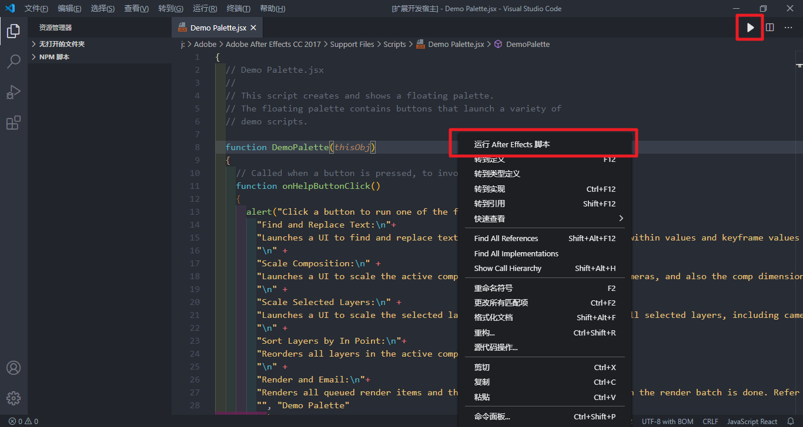

# After Effects 脚本运行器

[English introduction](./README-ZH.md) | [中文介绍](./README-ZH.md)

## 平台

- Windows
- Mac Os (没有Mac 不会写)

## 特性

- 运行.jsx, .jsxbin, and .tsx 脚本文件.
- 多版本检测,如果只启动一个ae则直接运行脚本,如果启动多个版本, 会提示你选择哪个版本进行测试

## 用法

打开ae, 在vsc中打开脚本文件,运行即可

命令位置如下:

<div align=center></div>

运行中的多版本ae检测:

<div align=center></div>

## 示例

请clone本示例进行你的第一个项目

[Yuelioi/Adobe-Scripting-With-Typescript-Demo](https://github.com/Yuelioi/Adobe-Scripting-With-Typescript-Demo)

## 失败了?

1. 确保有 `ts` 环境 (nodejs之类的)
2. tsconfig-ae.json或tsconfig.json 配置正确

## 工作原理

1. 使用node的child_process获取正在运行的ae路径
2. 用 `tsconfig-ae.json`(优先)或者 `tsconfig.json` 获取 `outDir` 配置.
3. 查找 `rollup.config.js`文件. 如果有则创建 `tsx-link.json` 临时文件(用于保存要运行的脚本路径), 然后执行 `rollup -c`
4. 使用命令行运行ae脚本(AfterFx.exe位置 -r 脚本位置)

## tsconfig.json

`outDir`: 脚本编译后的文件夹

`ES3`: AE脚本的js版本

[types-for-adobe](https://github.com/aenhancers/Types-for-Adobe) :AE脚本类型支持

`tsconfig.json` 示例:

```json
{
    "compilerOptions": {
        "target": "ES3",
        "ignoreDeprecations": "5.0",
        "strict": true,
        "noLib": true,
        "outDir": "./dist",
        "jsx": "preserve",
        "useDefineForClassFields": false,
        "noUnusedParameters": true,
        "noUnusedLocals": true,
        "skipLibCheck": true,
        "allowSyntheticDefaultImports": true,
        "noEmit": false,
        "resolveJsonModule": true,
        "esModuleInterop": true,
        "types": ["./node_modules/types-for-adobe/AfterEffects/22.0"]
    },
    "include": ["src/**/*.ts", "src/**/*.tsx"],
    "exclude": ["node_modules"]
}
```

## rollup

[Rollup](https://rollupjs.org/introduction/) 是一个用于 JavaScript 的模块打包器，它可以将小块代码编译成更大更复杂的代码。

▷ 安装

```txt
npm install typescript rollup rollup-plugin-typescript2 --save-dev
```

▷  Import 示例

```typescript
// A.tsx
export const str = "Hello World";

// B.tsx
import {num} from "./A"
alert(str)
```

▷ rollup.config.js 配置示例

```javascript
import typescript from "rollup-plugin-typescript2";
import rollup_json from "rollup-plugin-json";
import * as fs from "fs";

// tsk-link.json(插件会自动生成) : 输入输出文件路径

const readJSONFile = (filePath) => {
    const data = fs.readFileSync(filePath, { encoding: "utf8" });
    return JSON.parse(data);
};

const tsx_link = readJSONFile("./tsx-link.json");

export default {
    input: tsx_link["input"],
    output: {
        file: tsx_link["output"],
        format: "iife",
        name: "MyApp",
    },
    plugins: [
        typescript({
            tsconfig: "tsconfig.json",
        }),
        rollup_json(),
    ],
};
```

## 文件结构示例

```txt
/.vscode
dist
src
--/lib
--/public
--/utils
--main.tsx
tsconfig-ae.json
tsconfig.json
rollup.config.js
tsx-link.json(auto generate)
```

## 更新记录

- 0.6.0 - 2023-04-11: 支持多版本Ae(运行中的)

- 0.5.0 - 2023-03-15: 支持 .Jsxbin 文件

- 0.4.0 - 2023-03-10: 支持 Rollup

- 0.3.0 - 2023-03-02: 添加运行按钮

- 0.2.0 - 2023-03-02: 支持自定义ts配置 (tsconfgi-ae.json)

- 0.1.0 - 2023-03-01: 支持ts

## 参考

[atarabi.ae-script-runner](https://marketplace.visualstudio.com/items?itemName=atarabi.ae-script-runner)

[vscode-ae-script-linker](https://github.com/zpfz/vscode-ae-script-linker)
