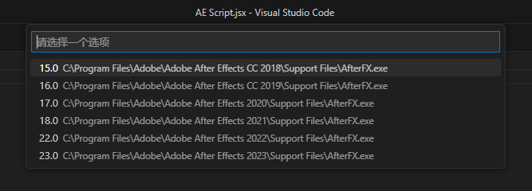

# AE Script Runner for VS Code 🚀

[](https://marketplace.visualstudio.com/items?itemName=yourname.ae-script-runner)
[](https://license/)
[](https://www.adobe.com/products/aftereffects.html)
[](https://www.adobe.com/products/aftereffects.html)

专为 After Effects 开发者设计的 VS Code 扩展，提供 TypeScript 工作流支持与多版本 AE 脚本执行能力。

*▲ 在 VS Code 中直接运行 AE 脚本*

---

## ✨ 核心特性

* **全格式支持**
  `.jsx` / `.jsxbin` / `.tsx` 脚本一键运行
* **智能版本检测**
  自动识别已安装的 AE 版本，多实例时提供选择菜单
* **跨平台支持**
  完美兼容 Windows 和 macOS 系统
* **TypeScript 优先**
  集成 Rollup 构建流程，支持现代 ES 特性
* **实时编译**
  文件保存后自动触发构建 (通过rollup  `--watch` 模式)

---

## 🚀 使用指南

1. **打开 AE 脚本文件**
   在 VS Code 中打开任意 `.jsx` 或 `.tsx` 文件
2. **运行脚本**

   * 点击编辑器右上角的 **▶ Run Script** 按钮
   * 或右键 运行ae脚本 命令`**


*▲ 多版本 AE 检测界面*

---

## 🛠 快速开始 (typescript 项目)

### 前置要求

* [Node.js](https://nodejs.org/) v16+
* [TypeScript](https://www.typescriptlang.org/) 4.9+
* [Rollup](https://rollupjs.org/) 3.x

### 安装扩展依赖

```bash
npm install -D \
  rollup \
  json5 \
  @rollup/plugin-typescript \
  types-for-adobe \
  @babel/core
```

---

## ⚙ 配置说明

### 推荐 tsconfig.json (仅typescript需要)

```json
{
  "compilerOptions": {
    "target": "ES3",
    "outDir": "./dist",
    "strict": true,
    "types": ["./node_modules/types-for-adobe/AfterEffects/22.0"]
  },
  "include": ["src/**/*.ts", "src/**/*.tsx"]
}
```

### 典型项目结构

```txt
.
├── .vscode/
│   └── settings.json    # 存储脚本路径配置
├── dist/                # 编译输出目录
├── src/
│   ├── lib/             # 公共库
│   ├── utils/           # 工具函数
│   └── main.tsx         # 入口文件
├── rollup.config.js     # 构建配置
└── tsconfig.json        # TS 类型配置
```

---

## 🔧 高级配置

### Rollup 构建示例

```js
// rollup.config.js
import typescript from '@rollup/plugin-typescript';
import jsxbin2 from 'rollup-plugin-jsxbin2';

export default {
  input: 'src/main.tsx',
  output: {
    file: 'dist/script.jsx',
    format: 'cjs'
  },
  plugins: [
    typescript(),
    jsxbin2({ 
      output: 'dist/script.jsxbin' 
    })
  ]
};
```

---

### 多版本指定配置

.vscode/settings.json

  "ae-tsx-runner": {
    "input": "....tsx",
    "output": "....jsx",
    "hostSpecifier": "22.0(win)/Adobe After Effects 2025(mac)" // 多版本时, 可以设置版本号(win)/应用名称(mac)来运行指定版本
  },

---

## 📜 版本历史

| 版本  | 日期       | 更新内容               |
| ----- | ---------- | ---------------------- |
| 0.7.0 | 2025-03-14 | 新增 macOS 系统支持    |
| 0.6.0 | 2023-04-11 | 实现多版本 AE 检测功能 |
| 0.5.0 | 2023-03-15 | 增加 .jsxbin 格式支持  |

[查看完整更新日志](https://changelog.md/)

---

## 🙌 致谢

* 类型定义来自 [Types-for-Adobe](https://github.com/aenhancers/Types-for-Adobe)
* 灵感来源于 [ae-script-runner](https://marketplace.visualstudio.com/items?itemName=atarabi.ae-script-runner)

---

## 📄 许可证

[MIT License](https://license/) © 2025 Yueli

---
